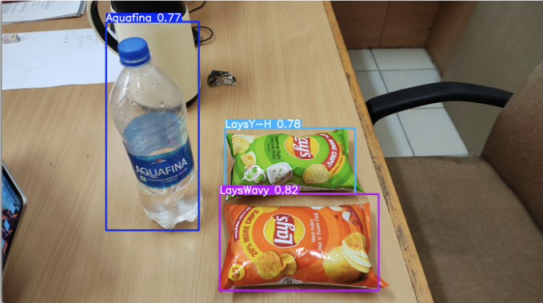
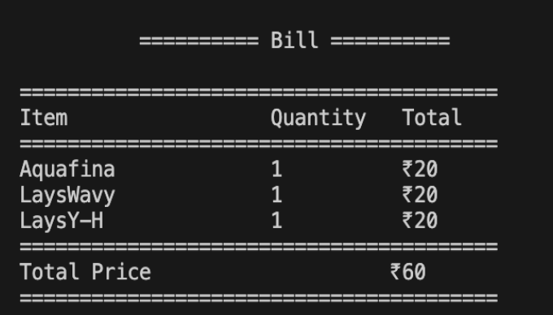

# 🧾 Automated Billing System Using Machine Learning and Image Processing

An intelligent grocery billing system that leverages **YOLOv5** and **OpenCV** to detect grocery items in real-time and automatically generate an itemized bill. Designed to streamline checkout processes in retail environments and reduce human effort.

---

## 🚀 Features

- 📸 **Real-time Object Detection**: Detects grocery items using a trained YOLOv5 model.
- 🧾 **Automated Billing**: Automatically counts item quantities and calculates the total cost.
- 💾 **CSV Export**: Saves billing data (item names, quantities, prices) to a CSV file for easy tracking and records.
- 🔄 **Batch or Real-time Processing**: Can work with both images and live webcam/video input.

---

## 🛠️ Technologies Used

- **Programming Language**: Python
- **Object Detection Framework**: YOLOv5 (built on PyTorch)
- **Computer Vision**: OpenCV
- **Data Processing**: Pandas, NumPy
- **Annotation Tool**: Roboflow (for labeling training images)


---

## 📊 Sample Output

Here are some example outputs from the system:

### 🎯 Detected Items from Image



### 🧾 Auto-Generated Bill (Terminal Output)



## 📦 Setup Instructions

### 1. Clone the repository
```bash
git clone https://github.com/roy-sid/Automatic-Billing-System.git
cd Automatic-Billing-System
```
### 2. Install dependencies
```bash
pip install -r requirements.txt
```
### 3. Download the YOLOv5 model weights 
Download the trained YOLOv5 weights from this link:
```
https://drive.google.com/drive/folders/1ccye_2Hjtl8hN_DAOvnHemlDBNyVpUSu
```

### 4. Run the detection and billing script
```
python detect_and_bill.py
```


